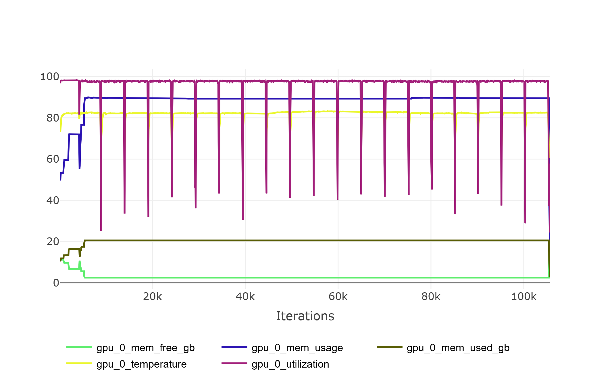
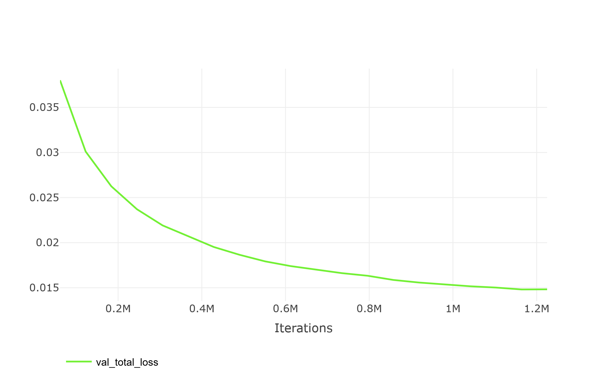
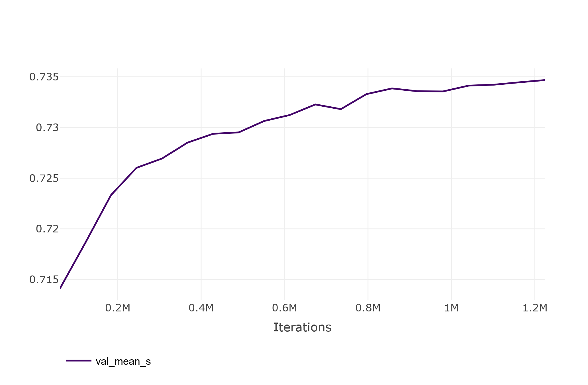
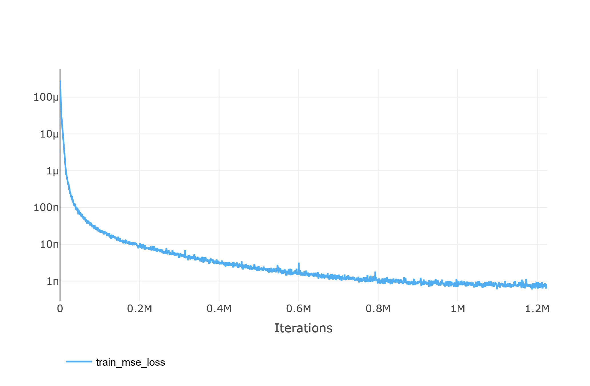

## Содержание

1. [Введение](#Introduction)
    
    1.1 [Команда](#Team)

2. [Цели](#Goals)
3. [Сопутствующая работа](#Related)
4. [Исходные данные](#Sources)
5. [Метод](#Methodology)
6. [Эксперимент](#Experiment)

    6.1 [Критерии](#Criteria)

    6.2 [Инструкции](#Instruction)

    6.3 [Базовые подходы](#Baselines)

7. [Результаты](#Results)
8. [Интерпретация](#Interpretation)
9. [Заключение](#Conclusion)

    [Ссылки](#References)

[]{#Introduction}

## 1 Введение 

В результате значительного развития нейросетевых моделей, всё большей проблемой становится локальный запуск и, тем более, обучение. Модель облачных вычислений достаточно универсальна, но не лишена недостатков - самым простым из серьёзных недостатков облачной модели является необходимость наличия в достаточной степени широкого и надёжного канала связи (также стоит учитывать задержки канала связи). Локальный же запуск сопряжён с другими проблемами, и чаще всего это проблема потенциального недостатка вычислительной мощности, т.е. на локальном устройстве может быть попросту недостаточно вычислительной мощности для запуска модели. Стоит сказать, что это уже достаточно распространённый случай не только в ситуации обучения модели, но даже в ситуации её инференса. И, помимо ранее сказанного, не самой плохой идеей является экономия энергии вычислительного устройства (энергоэффективные модели), и решение уже этой проблемы не сводится к наращиванию мощности вычислителя. Таким образом, актуальными становятся рассмотренные в рамках данной статьи техники уменьшения размеров моделей, которые так же дают значительное ускорение инференса. Таким образом, в результате получается нейросеть, которая может запускаться на значительно более слабых в вычислительном плане устройствах (и требуя меньше энергозатрат на вычисления), чем исходная. Этот момент особенно актуален для носимых устройств и аккумуляторных/батарейных IoT-модулей.

Данная работа интересна самим способом достижения результата. Чаще всего, уменьшение размеров модели достигается путём дистилляции и квантизации. В рамках данного проекта применён прунинг. В рамках поставленного эксперимента прунинг воспринимается как правильная инициация сети-ученика для дальнейшей дистилляции. Интересным фактом является то, что полученная таким образом модель (меньшего размера), но сопоставимого по качеству с оригинальной сетью. В рамках статьи эксперимент поставлен над моделью архитектуры BERT.

[]{#Team}

### 1.1 Команда 

Список участников проекта представлен в следующей таблице:

| Участник                       |         E-mail         | Роль                                |
|:-------------------------------|:----------------------:| :---------------------------------- | 
| Петров Александр Васильевич    |   petrov1c@yandex.ru   | экспериментатор, составитель отчёта |
| Сентюрев Михаил Алексеевич     | mixail_sen@outlook.com | экспериментатор, составитель отчёта |

[]{#Goals}

## 2 Цели 

В рамках проекта поставлена цель показать на практике, что возможно достичь уменьшения размера модели архитектуры BERT без заметного ухудшения качества выдаваемого результата, то есть, получить в результате более быструю и компактную сеть без заметной потери в качестве.

[]{#Related} 

## 3 Сопутствующая работа 

Методов уменьшения размера моделей, помимо предложенного в данной работе, существует несколько. Наиболее популярные из них: дистилляция и квантизация. Эти подходы так же могут применяться вместе.

По технике дистилляции существует, к примеру, [статья](https://arxiv.org/abs/1910.01108), в рамках которой была проделана работа по уменьшению размера оригинальной нейросети BERT. В результате была получена модель, названная DistilBERT. Авторы добились уменьшения числа параметров на 40%, сохранив при этом 97% исходного качества, как показывает бенчмарк GLUE.
Более подробно про данный метод и результаты можно прочитать в статье авторов: [https://arxiv.org/pdf/1910.01108](https://arxiv.org/pdf/1910.01108).

По технике квантования существует, к примеру, эта [статья](https://arxiv.org/abs/1602.02830), в рамках которой было выполнено обучение бинарных нейросетей на основе MNIST, CIFAR-10 и SVHN с получением уменьшения потребления вплоть до 32 раз (float переведён в bool) и ускорения вычислений вплоть до 7 раз (за счёт оптимизации вычислений на бинарных параметрах). При этом, была достигнута точность, достаточно близкая к исходной.
Более подробно про данный метод и результаты можно прочитать в статье авторов: [https://arxiv.org/pdf/1602.02830](https://arxiv.org/pdf/1602.02830).

[]{#Sources} 

## 4 Исходные данные 

К исходным данным для этой работы относится [датасет](https://translate.yandex.ru/corpus) (англо-русский параллельный корпус) от Yandex. Корпус содержит 1 миллион пар параллельных предложений на русском и английском языках, случайным образом выбранных из экспериментальных корпусов, собранных в 2011-2013 годах из параллельных документов, найденных в Интернете в автоматическом режиме. Размер архива с датасетом составляет 122 МБ, содержимое: два текстовых файла с предложениями на русском и английском языках, выровненными по номерам строк в кодировке UTF-8.
Доступ к датасету можно запросить непосредственно у компании Yandex по этой ссылке: [https://translate.yandex.ru/corpus](https://translate.yandex.ru/corpus).

В качестве исходный данных также был взят двуязычный вариант модели [LaBSE](https://huggingface.co/sentence-transformers/LaBSE), которая была разработана компанией Google. LaBSE - это BERT-подобная модель, разработанная для целей перевода между более чем 100 языками. Ключевым свойством архитектуры данной модели является то, что корпуса с разных языков отображаются в одно скрытое пространство таким образом, что близкие по смыслу высказывания отображаются в похожие по косинусной близости вектора. Благодаря такой архитектуре, стало возможным без значительных усилий создать вариант этой модели с меньшим числом поддерживаемых языком (и соответственно, меньшим размером модели) путём простого исключения из модели токенов, не относящихся к желаемым языкам. Именно таким путём была создана модель [LaBSE-en-ru](https://huggingface.co/cointegrated/LaBSE-en-ru). Автор этой модели оставил в её токенайзере только русские и английские токены, в результате чего модель уменьшилась в 4 раза, так как уменьшение количества токенов естественным образом уменьшило размер слоя эмбеддингов и выходного слоя пуллинга. Нельзя не упомянуть, что автор LaBSE-en-ru также получил из неё дистиллированную версию, которая в русскоязычном сообществе хорошо известна под названием [rubert-tiny2](https://huggingface.co/cointegrated/rubert-tiny2). Более подробно про эту модель автор рассказал в своей [статье](https://habr.com/ru/articles/562064/).

[]{#Methodology}

## 5 Метод 

За основу в данной работе взята модель LaBSE-en-ru. Так же нужно дать некоторые базовые определения для некоторых терминов, используемых в рамках статьи, а именно:

* `Pruning` (Прунинг) - это удаление определенных частей модели (подрезание);
* `Distillation` (Дистилляция) - это процесс передачи знаний от учителя к ученику.

Если описывать процесс кратко, то он делится на 3 этапа:

1. уменьшение за счёт исключения из исходной модели части голов внимания (attention heads); 
2. обучение полученной модели путём дистилляции знаний от оригинальной модели;
3. оценка качества полученной модели.

Теперь более подробно по каждому пункту. Для сокращения нотации, будет называть оригинальную модель (LaBSE-en-ru) - моделью-учителем,
а получаемую в рамках данной работы модель - моделью-учеником.

Оригинальная модель имеет 12 слоев внимания по 12 голов в каждом. На первом этапе применяется разложение в ряд Тейлора, чтобы понять, какие головы оказывают меньше всего влияния на выход энкодера. Суть подхода в том, что нейронная сеть и функция потерь представляются обычной функцией (веса модели модели представляются переменными), к котрой далее применяется разложение в ряд Тейлора $L(w)=\sum^P_{p=0}\frac{L^{(p)}(w_0)}{p!}(w-w_0)+R_p(w)$ до первого порядка:
$$ L(w=0)=L(w_0)-w_0\frac{\partial L}{\partial w}(w_0)+R_p(w) $$

$$ \operatorname{min}|L(w=0)-L(w_0)|=\operatorname{min}\left| w_0\frac{\partial L}{\partial w}(w_0)\right| $$

Далее принимается решение о важности конкретных весов согласно критерию Солиенси:
$$ \operatorname{mins}_w=\operatorname{min}\left| w\frac{\partial L}{\partial w}\right| $$

Данный способ был выбран по нескольким причинам:

1. прунинг как техника имеет подтверждения эффективности: например, [статья](https://arxiv.org/abs/1802.03494), где было показано, почему прунинг более эффективен, чем скейлинг;
2. прунинг через разложение в ряд Тейлора имеет [теоретическое обоснование](https://arxiv.org/abs/2102.00554);
3. он достаточно эффективен в реализации, так как коэффициенты ряда можно получить через накопление градиентов (далее, по величине накопленных градиентов определять важность голов).

Существует некоторая сложность, заключающаяся в том, что на каждом слое головы представлены общими линейными слоями. Так сделано
для целей оптимизации вычислений, так что нужно удалять головы, вырезая каналы из этих общих слоев.

На втором этапе для только что урезанной модели выполняется стягивание к выходам модели LaBSE-en-ru с использованием комбинированной функции потерь, состоящей из функции потерь, оценивающей похожесть русских и английских предложений, и функции потерь по выходам сети-учителя и сети-ученика.

Последний этап - замер качества - производится на бейнчмарке русскоязычных энкодеров [encodechka](https://github.com/avidale/encodechka), на основе которого будет производиться сравнение с LaBSE, LaBSE-en-ru, rubert-tiny2, так как целью является получение модели не сильно хуже по качеству, чем LaBSE и LaBSE-en-ru, и помимо этого, полученная модель не должна проиграть по качеству модели rubert-tiny2.

[]{#Experiment}

## 6 Эксперимент 

[]{#Criteria}

### 6.1 Критерии 

Качество модели было решено оценивать на бенчмарке [encodechka](https://github.com/avidale/encodechka). Бенчмарк оценивает качество эмбеддингов по следующим типам задач:

* `Semantic text similarity (STS)` на основе переведённого датасета STS-B;
* `Paraphrase identification (PI)` на основе датасета paraphraser.ru;
* `Natural language inference (NLI)` на датасете XNLI;
* `Sentiment analysis (SA)` на данных SentiRuEval2016;
* `Toxicity identification (TI)` на датасете токсичных комментариев из OKMLCup;
* `Inappropriateness identification (II)` на датасете Сколтеха;
* `Intent classification (IC)` и её кросс-язычная версия ICX на датасете NLU-evaluation-data, который был переведён на русский язык машинным переводом: в IC классификатор обучается на русских данных, а в ICX – на английских, в обоих случаях тестирование проводится на русском языке;
* `Named Entity Recognition (NER)` - распознавание именованных сущностей на датасетах factRuEval-2016 (NE1) и RuDReC (NE2): эти две задачи требуют получать эмбеддинги отдельных токенов, а не целых предложений, поэтому по этому критерию возможно оценить не все модели.

[]{#Instruction}

### 6.2 Инструкции 

Инструкции по подготовке окружения, получению данных, подключению системы отслеживания экспериментов находятся в [репозитории проекта](https://github.com/petrov1c/prune_labse_en_ru)
в файле `README.md`, ориентироваться стоит на них. В этом разделе же приведены только основные инструкции.

Последовательность действий:

1. Настроить python-окружение (venv):

    1.1 Создать: `python3 -m venv /path/to/new/virtual/environment`
    
    1.2 Активировать: `source /path/to/new/virtual/environment/bin/activate`

2. Установить зависимости: `make install` (нужно находиться в корневой папке проекта)
3. Установить и настроить ClearML (для получения метрик эксперимента): 

    3.1 В venv выполнить выполнить: `pip install clearml`
    
    3.2 В venv в корневой папке проекта выполнить `clearml-init` и следовать инструкциям

4. Запустить пайплайн эксперимента: `make train`
5. Посмотреть результаты экспериментов можно в Вашем профиле ClearML или локально в папке `experiments` (находится в корневой папке проекта)
6. Проверить качество полученной модели, выполнив команду `make infer`, либо через Jupiter Notebook (`notebooks/encodechka_evaluation_2024.ipynb`)

*Для запуска обучения важным моментом является объём видеопамяти на Вашей видеокарте. Требуется не менее 24 ГиБ видеопамяти.*

[]{#Baselines} 

### 6.3 Базовые подходы 

Самым простым по концепции (при этом, сложным в деталях) является путь дистилляции. Существует множество примеров реализации этого подхода, например, путь появления модели rubert-tiny2, который описан автором в [статье](https://habr.com/ru/articles/562064/).

[]{#Results}

## 7 Результаты 

По этой [ссылке](https://app.clear.ml/projects/4198751ef62241b5a317649d8357615d/experiments/048926e387ac48ccaf184f338e9d86ef/output/execution) можно ознакомиться с полным циклом эксперимента и полученными графиками. По этой [ссылке](https://github.com/petrov1c/prune_labse_en_ru/blob/master/notebooks/encodechka_evaluation_2024.ipynb) в репозитории можно ознакомиться со всеми численными результатами эксперимента (метриками). В этом разделе содержатся только некоторые данные эксперимента из ClearML и репозитория. 

[]{#gpu_util}
\
\centerline{Рисунок 1: Использование GPU}

\
[]{#total_loss}
\centerline{Рисунок 2: Кривая функции потерь модели}

[]{#metrics_score}
\
\centerline{Рисунок 3: Кривая метрик качества по бенчмарку}

[]{#mse_loss}
\
\centerline{Рисунок 4: Функция потерь на разности русских и английских предложений}

[]{#sota}
Результаты по критериям (жирным выделены наибольшие значения, курсивом обозначена финальная модель):

| model                       |    STS |     PI |    NLI |     SA |     TI |     IA |     IC |    ICX |
|:----------------------------|:------:|:------:|:------:|:------:|:------:|:------:|:------:|:------:|
| LaBSE-en-ru    | 0.7944 | **0.6587** | 0.4307 | 0.761  | 0.9463 | **0.7658** | **0.7892** | **0.7688** | 
| LaBSE | **0.7946** | 0.6574 | 0.4305 | 0.762  | **0.9476** | 0.7658 | 0.7888 | 0.7634 |  
| *tune_model.pth*       | 0.7894 | 0.6507 | ***0.4323*** | ***0.7623*** | 0.9391 | 0.7566 | 0.7804 | 0.7656 |  
| rubert-tiny2   | 0.7504 | 0.6514 | 0.417  | 0.7373 | 0.9367 | 0.7461 | 0.7562 | 0.6396 |    0.704 |
| prune_model.pth      | 0.7187 | 0.4893 | 0.3758 | 0.7147 | 0.9235 | 0.7107 | 0.7092 | 0.5742 |    0.652 |

Результаты по среднеквадратичному значению критериев и вычислительной нагрузке (жирным выделены наибольшие значения, курсивом обозначена финальная модель):

| model                       |  Mean S |   CPU |
|:----------------------------|:--------:|:-----:|
| cointegrated/LaBSE-en-ru    | **0.739** |  **20**  |
| sentence-transformers/LaBSE |  0.739 |  19.7 |  
| *models/tune_model.pth*       |   0.735 |  11.9 |  
| cointegrated/rubert-tiny2   |   1.7 |   1   | 
| models/prune_model.pth      |  12   |   2.5 | 

Размеры моделей (курсивом обозначена финальная модель):

| Name           | Type             | Params
| ---------------|------------------|--------------
| teacher_model  | BertModel        | 128 M 
| *student_model*  | BertModel        | 85.8 M

[]{#Interpretation}

## 8 Интерпретация 

Обучение проходило на видеокарте NVIDIA GeForce RTX 3090 при полной утилизации GPU, что показано на [рисунке 1](#gpu_util).
Функция потерь на валидации постоянно падала, даже на последней эпохе, что позволяет предположить, что можно получить еще более качественную модель ([рисунок 2](#total_loss)).
Качество модели, оцениваемое по бенчмарку, в процессе обучения практически постоянно росло ([рисунок 3](#metrics_score)).
Интересно, что одна составляющая функции потерь, которая отвечала за похожесть русских и английских предложений, в процессе обучения практически сошлась в ноль, однако, она все-равно осталась в качестве регуляризатора ([рисунок 4](#mse_loss)).

По итогу, была получена модель, которая в 1.5 раза меньше по количеству параметров, на 40% быстрее на CPU, имеет в два раза меньшую вычислительную сложность (на CPU и GPU суммарно), по среднему проценту качества на всех задачах отличается от оригинальной сети менее, чем на 0.5%, в то же время, на задачах `NLI` и `SA` показывает качество выше оригинальной сети, то есть наш подход показал [SotA](#sota) на полученном нами датасете.

[]{#Conclusion}

## 9 Заключение 

Результаты этой работы показывают, что можно эффективно уменьшать и ускорять модели путём прунинга с последующей дистилляцией.
Текущий результат был получен в ограничениях как по вычислительным ресурсам (NVIDIA GeForce RTX 3090), так и по времени (несколько суток проведения экспериментов). Однако, он вполне сопоставим с результатами известных работ, описанных [пункте 3](#Related). Более того, по некоторым метрикам был получен [SotA](#sota).

При этом, ряд техник не был применен из-за ограниченности по времени. Авторы данной работы планируют продолжить этот эксперимент с целью уменьшения исходной модели, как минимум, в 10 раз, так как такой коэффициент сжатия более чем согласуется с [теорией лотерейных билетов](https://openreview.net/forum?id=rJl-b3RcF7).

[]{#References}

## Ссылки 

1. [Дале, 2021] Давид Дале (2021). Маленький и быстрый BERT для русского языка // https://habr.com/ru/articles/562064
2. [Frankle, Carbin, 2019] Jonathan Frankle, Michael Carbin (2019). THE LOTTERY TICKET HYPOTHESIS: FINDING SPARSE, TRAINABLE NEURAL NETWORKS // https://openreview.net/forum?id=rJl-b3RcF7
3. [Frankle, Dziugaite, Roy, Carbin, 2020] Jonathan Frankle, Karolina Dziugaite, Daniel M. Roy, Michael Carbin (2020). Stabilizing the Lottery Ticket Hypothesis // https://arxiv.org/abs/1903.01611
4. [Courbariaux, Hubara, Soudry, El-Yaniv, Bengio, 2016] Matthieu Courbariaux, Itay Hubara, Daniel Soudry, Ran El-Yaniv, Yoshua Bengio (2016). Binarized Neural Networks: Training Neural Networks with Weights and Activations Constrained to +1 or −1 // https://arxiv.org/abs/1602.02830
6. [HOEFLER, ALISTARH, BEN-NUN, DRYDEN, PESTE, 2021] TORSTEN HOEFLER, DAN ALISTARH, TAL BEN-NUN, NIKOLI DRYDEN, ALEXANDRA PESTE (2021). Sparsity in Deep Learning: Pruning and growth for efficient inference and training in neural networks // https://arxiv.org/abs/2102.00554
7. [SANH, DEBUT, CHAUMOND, WOLF, 2020] Victor SANH, Lysandre DEBUT, Julien CHAUMOND, Thomas WOLF (2020). DistilBERT, a distilled version of BERT: smaller, faster, cheaper and lighter // https://arxiv.org/abs/1910.01108
8. [He, Lin, Liu, Wang, Lil, Han, 2019] Yihui He, Ji Lin, Zhijian Liu, Hanrui Wang, Li-Jia Lil, Song Han (2019). AMC: AutoML for Model Compression and Acceleration on Mobile Devices // https://arxiv.org/abs/1802.03494